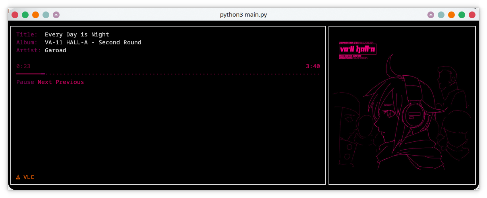

# Terminal-Music-Controller

~~Control~~ Monitor your music from the terminal, with curses!




## Requirements
- installed `playerctl`
- Python 3 (any version compatible with `curses`)
  - `colorthief 0.2.1`
  - `pillow 10.3.0`
- Terminal that supports images, `kitty icat` is used for album art here though
  - Tested with `Konsole` and `Kitty`. Works best with `Kitty`, `Konsole` needs some work...
- Nerf Font (optional, used only for player logos)

## Usage
Install reqs and just run:
```bash
python3 main.py
```
## Features
- scrollable text if longer than window
- Album art!
- moving progress bar
- colors taken from the album art
- colors of active position (current time) and progress bar blend seamlessly to colors of total time
## Roadmap
- buttons for playback control
- ~~resizing?~~ ✅
- ~~better album art scaling~~ ✅
- ~~colors from album art~~ ✅
- ~~detect player and change the text accordingly~~ 🤏
  - Apple Music (Cider) and VLC are coded, rest... TODO
  - If you use Spotify or Youtube Music... what are you doing here? There is `spotify-tui` and `ytermusic`!