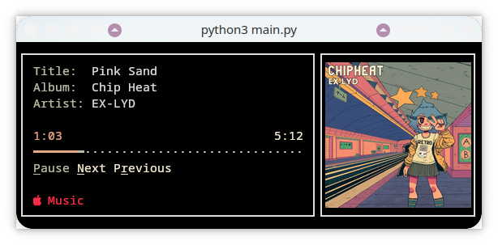

# Terminal-Music-Controller

~~Control~~ Monitor your music from the terminal, with curses!

## Requirements
- installed `playerctl`
- Python 3 (any version compatible with `curses`)
  - `colorthief 0.2.1`
  - `pillow 10.3.0`
- Kitty for terminal (or any other that supports images, `kitty icat` is used for album art here though)

## Usage
Just run:
```bash
python3 main.py
```
## Features
- scrollable text if longer than window
- Album art!
- moving progress bar
- colors taken from the album art
## Roadmap
- buttons for playback control
- resizing?
- better album art scaling
- ~~colors from album art~~